# Web Assignment 9

> Student: Lý Võ Mỹ Hoa - 24133017

## Overview

- **Bài 1**: Xác thực phiên với Spring Security 7, cấu trúc thực thể User - Role, chuyển đổi các DTO linh hoạt thông qua MapStruct, mã hóa mật khẩu an toàn với BCrypt và hiển thị phiên đăng nhập người dùng trên giao diện Thymeleaf.
- **Bài 2**: Cơ chế đăng nhập hỗ trợ đăng nhập linh hoạt bằng cả Username và Email, hiển thị thông tin hồ sơ kèm ảnh đại diện của người dùng trên thanh điều hướng.
- **Bài 3**: Cổng thông tin quản trị hoàn chỉnh:
  - Khôi phục và đặt lại mật khẩu với xác thực Email OTP.
  - Phân quyền truy cập dựa trên vai trò (`ROLE_ADMIN`, `ROLE_USER`).
  - Đăng ký tài khoản và xác thực kích hoạt an toàn thông qua mã xác nhận Email OTP.
  - Tải lên và quản lý hình ảnh sản phẩm/người dùng qua dịch vụ đám mây Cloudinary.
  - Quản lý người dùng (`Users Management`) dành riêng cho Quản trị viên.
  - Quản lý sản phẩm (`Products Management`) dành cho người dùng đã đăng nhập.

## URLs

- Dashboard: [http://localhost:8080/](http://localhost:8080/)
- Products Management: [http://localhost:8080/products](http://localhost:8080/products)
- Create Product: [http://localhost:8080/products/create](http://localhost:8080/products/create)
- Users Management: [http://localhost:8080/users](http://localhost:8080/users)
- Create User: [http://localhost:8080/users/create](http://localhost:8080/users/create)
- Login: [http://localhost:8080/login](http://localhost:8080/login)
- Register: [http://localhost:8080/register](http://localhost:8080/register)
- Verify OTP: [http://localhost:8080/verify-otp](http://localhost:8080/verify-otp)
- Forgot Password: [http://localhost:8080/forgot-password](http://localhost:8080/forgot-password)
- Reset Password: [http://localhost:8080/reset-password](http://localhost:8080/reset-password)

## Screenshots

### Dashboard

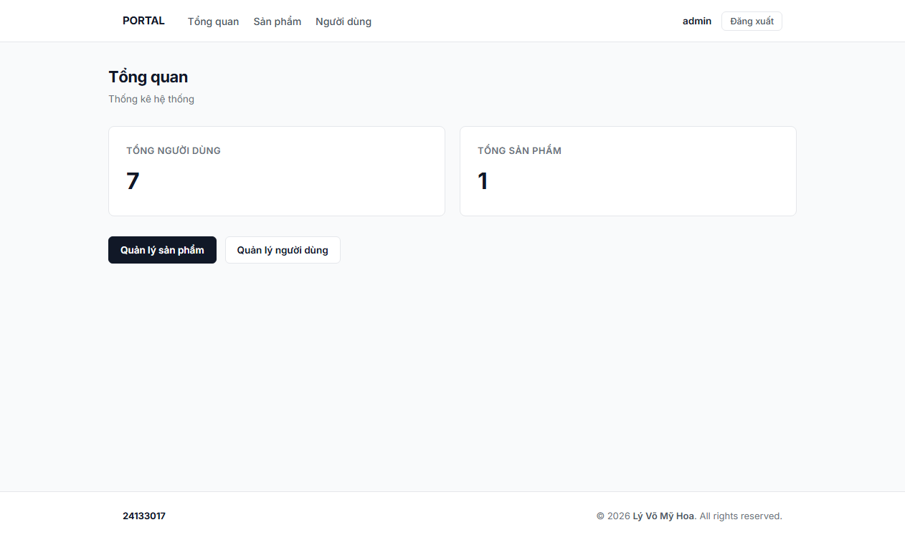

### Product Management

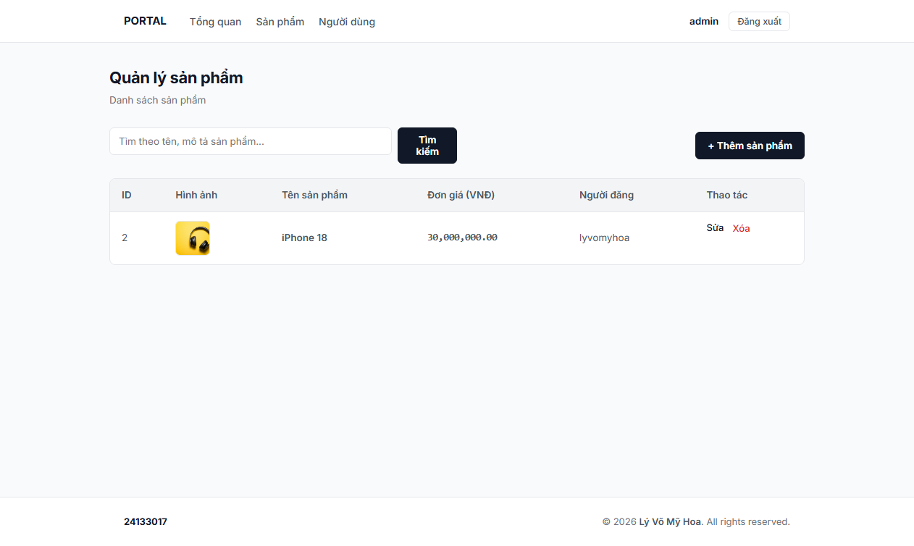

### Create Product

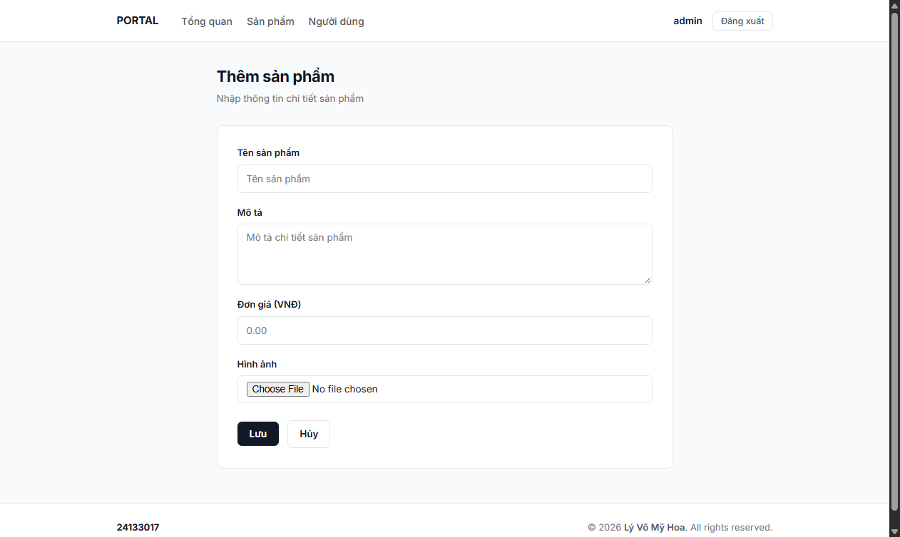

### User Management

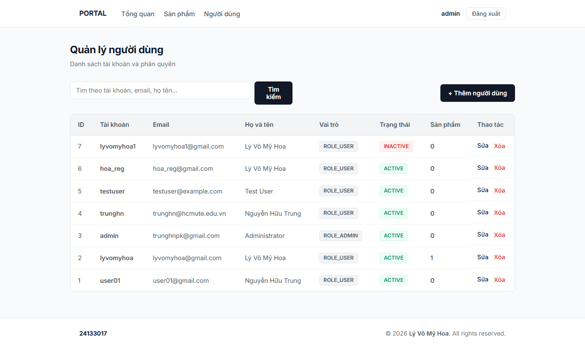

### Create User

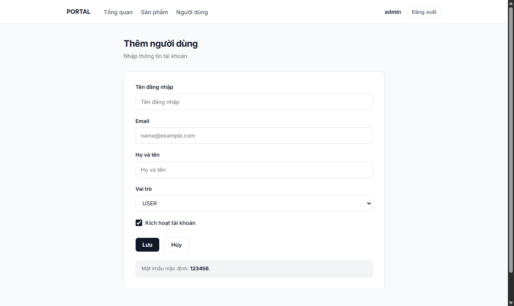

### Login

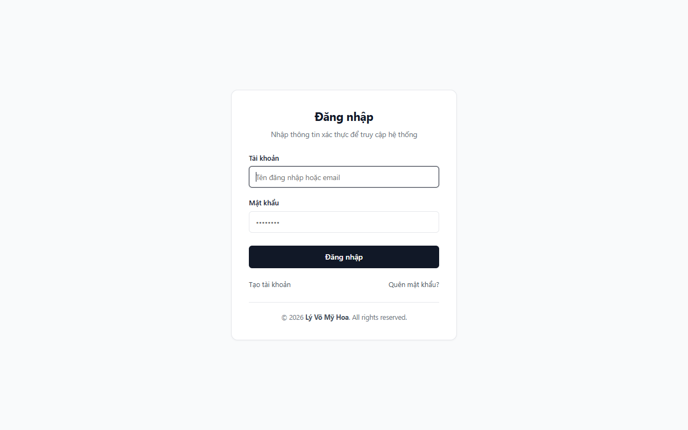

### Register

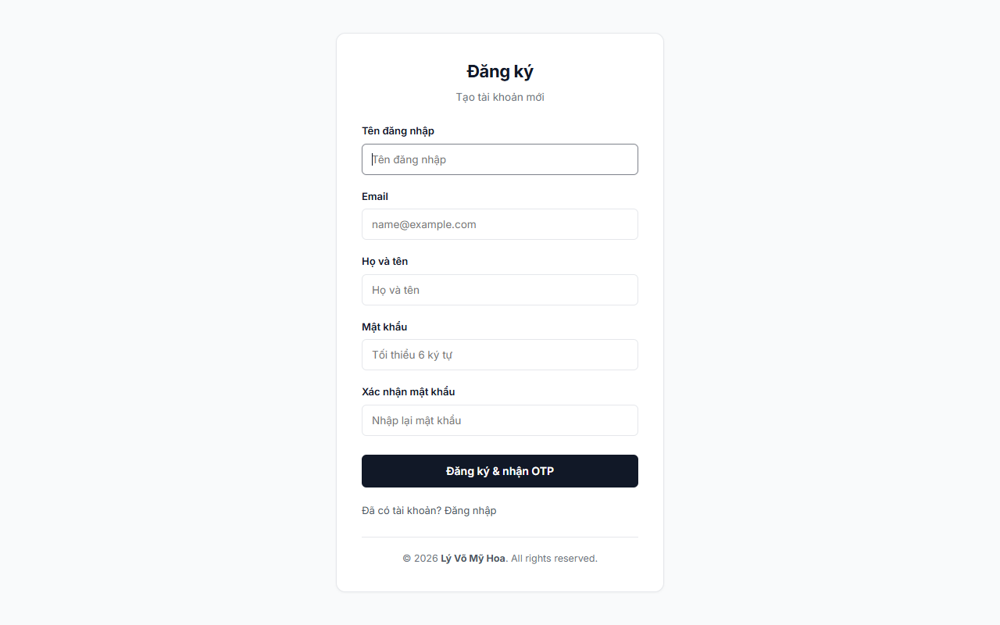

### Email OTP Verification

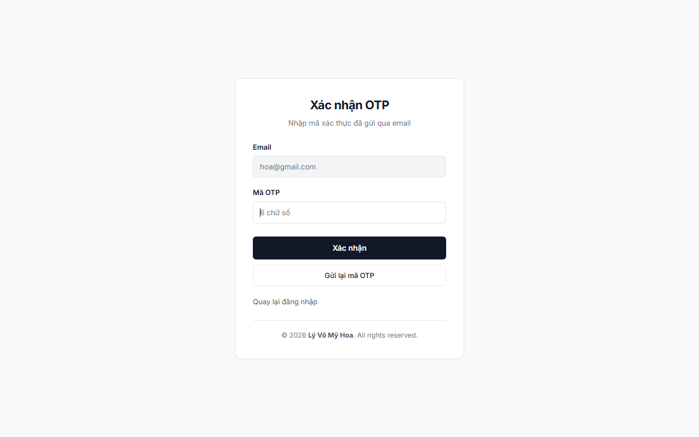

### Forgot Password

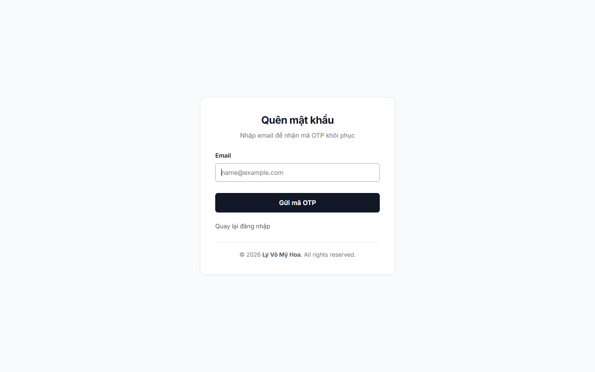

### Reset Password

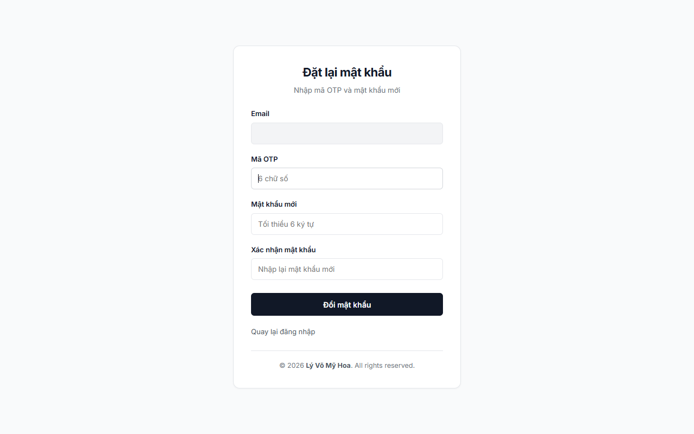

### Home (Guest View)

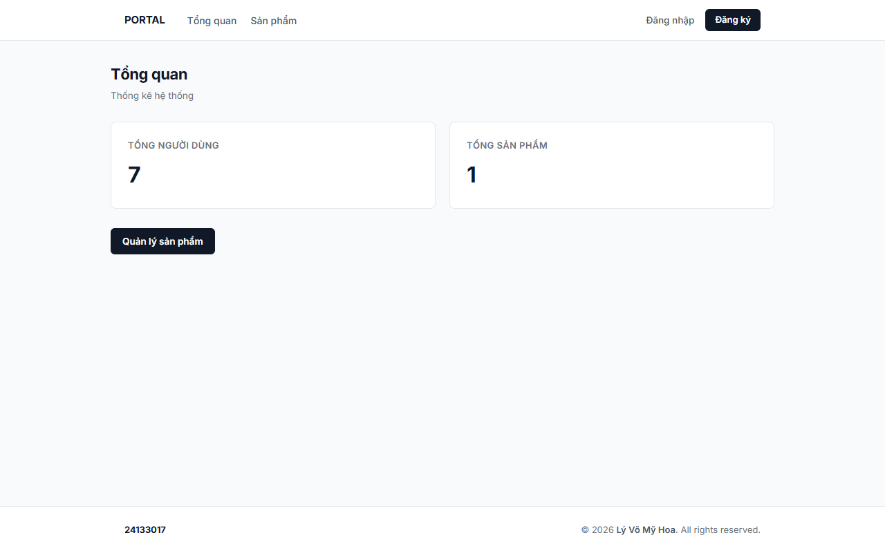